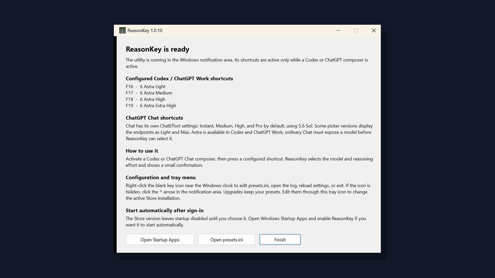

# ReasonKey

Fast, configurable keyboard shortcuts for selecting both the **model** and the
**reasoning effort** in the Codex and ChatGPT composers of the Windows desktop
app.

> Unofficial community utility. It is not made, endorsed, or supported by
> OpenAI. The official Windows app is documented in the
> [OpenAI documentation](https://learn.chatgpt.com/docs/windows/windows-app).

## Install in one click

[**Download ReasonKey-Setup.exe**](https://github.com/nauroman/codex-model-hotkeys/releases/latest/download/ReasonKey-Setup.exe)

Run the downloaded installer. It installs for the current Windows user, starts
immediately, and starts automatically when you sign in. AutoHotkey is bundled
in the compiled release and does not need to be installed separately.

Because the executable is currently unsigned, Windows SmartScreen may show a
warning. Use **More info → Run anyway** only if the publisher URL and checksum
match this repository. Every release includes a SHA-256 checksum.

ReasonKey is also available from the
[**Microsoft Store**](https://apps.microsoft.com/detail/9NLDRHX8Z0B1). See
[MSIX packaging](packaging/msix/README.md) for the reproducible package build,
local test, identity, and submission process.



If you downloaded the source ZIP or cloned the repository, double-click
[`Install.cmd`](Install.cmd). It uses a locally built installer from `dist` when
present; otherwise it downloads the latest installer and verifies its published
checksum before running it.

## Build the executables yourself

If you prefer not to run a binary published by someone else, you can inspect
this repository and compile the same AutoHotkey sources locally. Neither the
build nor the per-user installer requires administrator rights.

1. Download the source with **Code → Download ZIP**, or clone it:

   ```powershell
   git clone https://github.com/nauroman/codex-model-hotkeys.git
   Set-Location .\codex-model-hotkeys
   ```

   To build a particular release instead of the current `main` branch, select
   its tag on GitHub or run `git checkout vX.Y.Z` after cloning.

2. Review the files that will be compiled. Good starting points are the
   [runtime](src/ReasonKey.ahk), [installer](installer/Setup.ahk),
   [uninstaller](installer/Uninstall.ps1), and [build script](scripts/Build.ps1).

3. Open Windows PowerShell in the extracted repository folder and run:

   ```powershell
   powershell.exe -NoProfile -ExecutionPolicy Bypass `
     -File .\scripts\Build.ps1 -Clean
   ```

   `-ExecutionPolicy Bypass` applies only to that new PowerShell process. It
   does not permanently change the Windows execution policy or disable an
   antivirus.

4. Find your locally built files in `dist\`:

   ```text
   dist\ReasonKey.exe
   dist\ReasonKey-Setup.exe
   dist\ReasonKey-Setup.exe.sha256
   ```

The build script uses an installed AutoHotkey v2 toolchain when available.
Otherwise, the first build downloads the official portable
[AutoHotkey v2](https://github.com/AutoHotkey/AutoHotkey/releases) runtime and
[Ahk2Exe](https://github.com/AutoHotkey/Ahk2Exe/releases) compiler into the
local `.tools\` folder. It then compiles both executables, runs their built-in
`--validate` checks, validates the uninstaller path guards, and generates the
installer's SHA-256 file.

A local build is independent of the executable attached to GitHub Releases. It
may not be byte-for-byte identical because the build script currently uses the
installed or latest available AutoHotkey toolchain. See
[Development](docs/DEVELOPMENT.md) to run directly from source and for the full
test matrix.

## Trust and verification

No antivirus result, checksum, or open-source repository can prove that a
program is completely safe. They provide different evidence that can be
checked together:

- Inspect the source and build it locally as described above. This avoids
  running the prebuilt release executable.
- Download the installer and its `.sha256` file from the same GitHub release,
  then compare them in PowerShell:

  ```powershell
  $expected = ((Get-Content .\ReasonKey-Setup.exe.sha256 -Raw) `
    -split '\s+')[0]
  $actual = (Get-FileHash .\ReasonKey-Setup.exe `
    -Algorithm SHA256).Hash
  $actual -ieq $expected
  ```

  `True` confirms that the downloaded bytes match the published checksum. It
  does not by itself prove that the program's behavior is safe.
- Scan the downloaded file with Microsoft Defender or another locally
  installed antivirus before running it.
- Look up the SHA-256 or submit the **public release executable** to
  [VirusTotal](https://www.virustotal.com/gui/home/upload) for results from many
  security engines. A clean report is useful supporting evidence, not a
  security guarantee; standard VirusTotal submissions are shared with its
  security partners.
- Review [How it works](docs/HOW_IT_WORKS.md), including the documented runtime
  boundaries: the direct EXE makes no network requests, while the Store package
  asks Microsoft Store only for ReasonKey updates. Neither channel uses an API
  key or edits Codex/ChatGPT files.
- Review the [privacy policy](PRIVACY.md) and [security policy](SECURITY.md).

## Default shortcuts

In **Codex** and **ChatGPT Work**, new installations use:

| Shortcut | Model | Reasoning effort |
|---|---|---|
| `F16` | GPT-6 Astra | Light |
| `F17` | GPT-6 Astra | Medium |
| `F18` | GPT-6 Astra | High |
| `F19` | GPT-6 Astra | Extra High |

When the composer is in **ChatGPT Chat** instead of **Codex**, the same hotkeys
select 5.6 Sol on Chat's independent Power scale:

| Shortcut | Chat model | Power |
|---|---|---|
| `F16` | 5.6 Sol | Instant |
| `F17` | 5.6 Sol | Medium |
| `F18` | 5.6 Sol | High |
| `F19` | 5.6 Sol | Pro |

Chat uses its independent `ChatEffort` values. Some unified-picker versions
display the `Instant` and `Pro` endpoints as `Light` and `Max`; ReasonKey
retains that compatibility. An unavailable option fails explicitly instead of silently
choosing a different level.

Ordinary Chat has a separate model catalog. In the tested 26.903 app it exposes
Latest, GPT-5.6 Sol and GPT-5.5, without Astra. Use **Codex** or **ChatGPT Work**
for the Astra presets above; ReasonKey cannot unlock a model absent from the picker.

The shortcuts are active only while the Codex/ChatGPT desktop window is active. They do not
capture these keys globally in other applications.

## Customize presets

Right-click the **ReasonKey** tray icon and choose
**Open presets.ini**. Change any hotkey, model, or effort, save, then choose
**Reload** from the tray menu.

The tray icon is the black key with green-and-white chevrons in the Windows
notification area near the clock. If it is hidden, click the **^** arrow to
show hidden icons. Hover over it to confirm that its tooltip starts with
**ReasonKey**.

The installed `presets.ini` contains a beginner-oriented explanation of every
setting and the supported hotkey syntax. **Open configuration guide** opens an
always-current commented example. Upgrades preserve the active `presets.ini`.

**Still selecting Luna or Sol after upgrading?** Open `presets.ini` through the
running ReasonKey tray icon. Store and direct EXE installations have separate
configuration files, and upgrading deliberately keeps existing presets. Set
`Model=Astra` in Preset1–Preset4 and their `Effort` values to `Light`, `Medium`,
`High`, `Extra High`, respectively, then save and choose **Reload**. The tray
command opens the file used by the active runtime.

Supported model names are `Luna`, `Terra`, `Sol`, and `Astra` (GPT-6).
To select GPT-6 Astra, set `Model=Astra` in the desired preset, save, and
choose **Reload** from the tray menu. For example, `Model=Astra` with
`Effort=Max` selects `6 Astra Max` in Codex. Existing presets and ChatGPT's
independent Sol/ChatEffort mapping are preserved during upgrades.
Supported effort names
are `Light`, `Medium`, `High`, `Extra High`, `Max`, and `Ultra`, subject to what
the selected model and your OpenAI account expose. Each preset can also set an
independent `ChatEffort` of `Instant`, `Medium`, `High`, or `Pro`. Those names
remain the configuration compatibility contract; some picker versions display
them as `Light`, `Medium`, `High`, and `Max`. Existing configuration files
without `ChatEffort` automatically receive the four legacy values for presets
1 through 4.

AutoHotkey hotkey syntax is used. For example:

```ini
[Preset1]
Hotkey=^!1
Name=Luna High
Model=Luna
Effort=High
```

`^!1` means `Ctrl+Alt+1`.

## How it works

Current Codex and ChatGPT Chat composers use a unified picker with
`Select model` and a keyboard-controlled Power row. ReasonKey also retains the
older compact Power and expanded Advanced picker paths. It detects the active
composer and an already-open picker, selects through keyboard-accessible UI
Automation controls, and verifies the final picker Button. It does not edit
Codex/ChatGPT files or send API requests.

See [How it works](docs/HOW_IT_WORKS.md) for the state machine and selector
details.

## Requirements and compatibility

- Windows 10 or Windows 11
- Codex/ChatGPT Windows desktop app with a Codex or ChatGPT Chat composer
- English UI labels in the current release

The current unified Codex and ChatGPT paths were validated against desktop
package `OpenAI.Codex_26.903.8094.0_x64__2p2nqsd0c76g0`. The legacy Advanced
path remains for compatibility with the earlier 26.825 builds. UI Automation
labels are not a public compatibility contract, so future desktop updates can
require selector updates.

## Logs and troubleshooting

Right-click the tray icon and choose **Open log**. The log is stored at:

```text
%LOCALAPPDATA%\ReasonKey\ReasonKey.log
```

The Microsoft Store package uses its per-user package `LocalState` directory;
the tray command opens the correct log for the installed channel.

On every active Microsoft Store launch, ReasonKey asks the Store whether a
newer package is available. Windows installs it silently when the user's Store
auto-update setting and network policy allow that, then restarts ReasonKey so
it returns to the notification area. If Windows disallows a silent update
(for example, auto-updates are disabled or the network is metered), ReasonKey
does not override the user's setting and tries again on the next launch. The
direct EXE does not run this Store-only update helper.

See [Troubleshooting](docs/TROUBLESHOOTING.md) before opening an issue.

The [1.0.10 validation report](docs/diagnostics/release-1.0.10.md) records the
tested desktop version, actual picker results and remaining external checks.

## One runtime across Store and direct installs

The Store package and direct installer use the same per-session singleton. If
both channels are installed, whichever current ReasonKey runtime starts first
remains active and a second launch exits without registering another set of
hotkeys or showing another Quick Start window. Version 1.0.4 also migrates and
stops the older `CodexModelHotkeys.exe` runtime from release 1.0.3.

## Uninstall

Open **Windows Settings → Apps → Installed apps**, find
**ReasonKey**, and choose **Uninstall**.

For the Store channel, Windows also removes package-owned configuration and log
files. The direct installer keeps its existing per-user uninstall behavior.

## Development

The source is AutoHotkey v2 and uses the MIT-licensed UIA-v2 library. See
[Development](docs/DEVELOPMENT.md) for layout, build, validation, and release
instructions.

For project work, start with the [product specification](docs/product-spec.md),
which routes to the exact owners of presets, picker interaction, installation
and Store updates. [Project context](docs/PROJECT_CONTEXT.md) maps those contracts
to source and validation entry points. Historical reports are kept separately.

## License

MIT. See [LICENSE](LICENSE) and [third-party notices](THIRD_PARTY_NOTICES.md).
